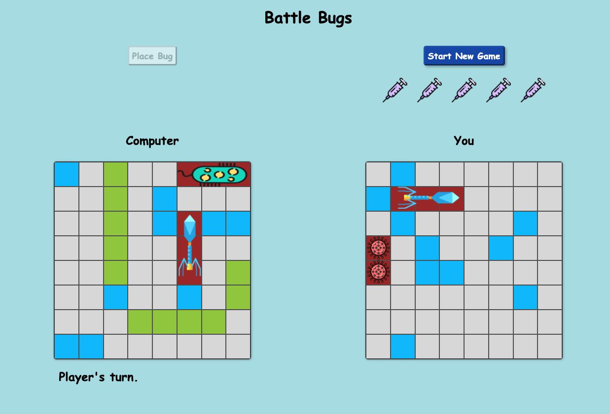

# Battle Bugs
## A New Take on a Classic Game

Everyone knows Battle Ship, where you have to sink your opponent's ships before they sink yours. But with Battle Bugs, the race is on to cure yourself of infection -- caused by the computer -- before the computer cures itself of its infection -- caused by you.

Battle Bugs showcases significant computer logic, meaning that you will have a worthy opponent, every round.

Rules: First, you'll pick the best locations for your bugs on the computer's grid. Once all five bugs are placed, the computer will place five bugs on your grid. Next, you get five shots to try to figure out where the computer hid his bugs on your grid. Finally, the computer will have five shots to do the same on its grid. Game play goes back and forth until either you or the computer has found all the bugs.

 

## Screenshots

 

## Technologies
The game was built with:
* Javascript
* HTML
* CSS

 

## Getting Started
If you'd like to test your luck against the computer, you can [download the game](https://dtangie.github.io/BattleBugs/).

Link: [https://dtangie.github.io/BattleBugs/](https://dtangie.github.io/BattleBugs/)

 

## Future Enhancements
Graphics Improvements. Let's take this out of the 1990's.